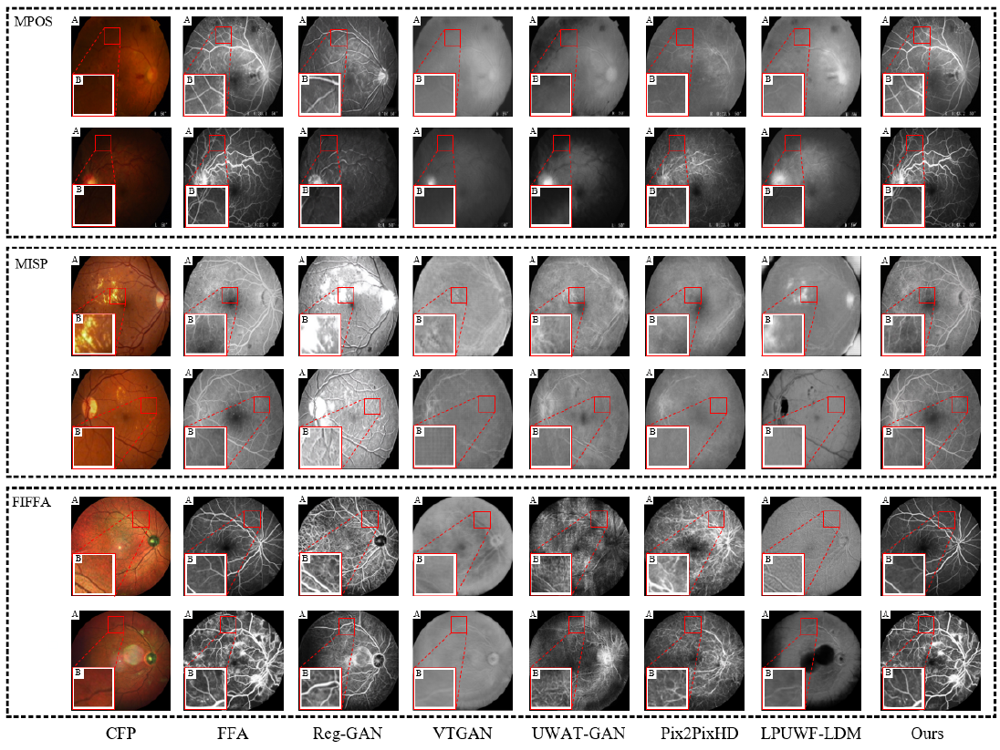
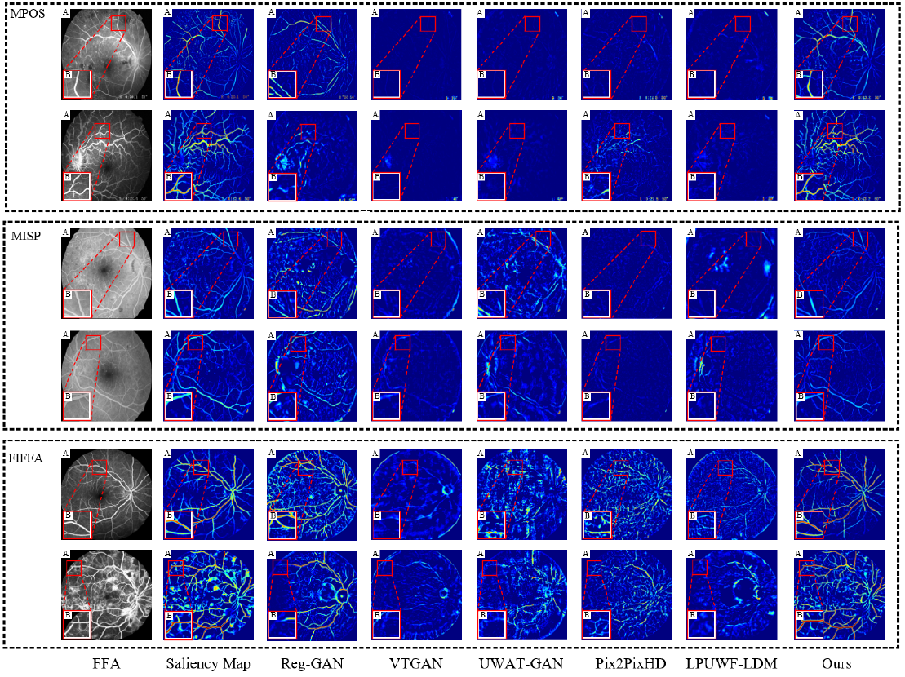
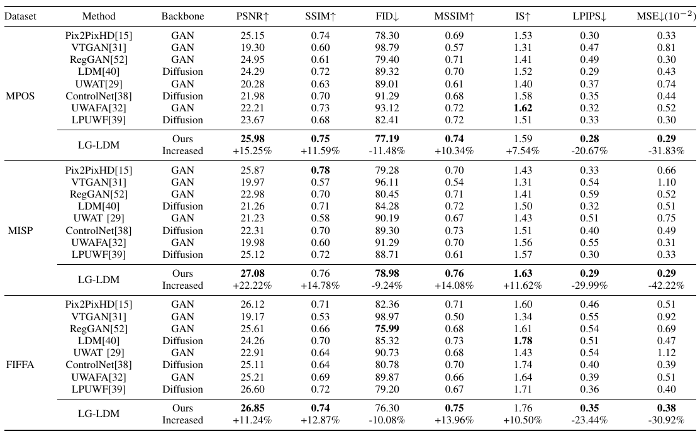

# **LG-LDM**
Overall subjective experimental results:

 saliency map：

Overall objective experimental results：


## Pre-requisties
- Linux
- torch==2.6.0+cu124
- monai==1.3.0
- monai-generative==0.2.3
- pyYAML==6.0.1
- accelerate==0.27.2
- numpy==1.26.3
- tqdm==4.66.2
- six==1.7.0
- natsort==8.4.0
- pillow==11.0.0
## How to train
We have provided sample data in data_deample. In the first stage of training our VAE, we only need to run 
```
 python vae/DMD_cvae.py
```

while in the second stage of training, we need to run Python diffusion/mtil_comdi-diff-py
```
 python diffusion/mtil_comdi-diff-py
```
## Acknowledgments

We sincerely thank Tinysqua for his work (https://github.com/Tinysqua/LPUWF-LDM) as well as for organizing the PyTorch implementations of UWAFA-GAN, UWAT-GAN, and VTGAN. The present project builds upon these contributions, and our goal is to organize publicly available dataset to help advance progress in this field.
 
